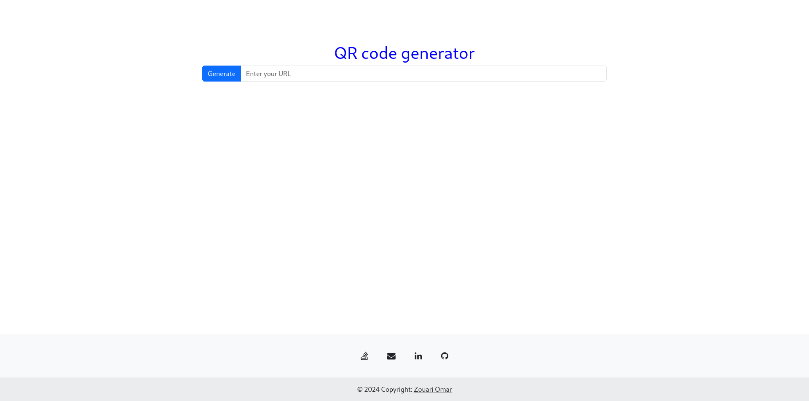

<!-- @format -->

# QRME - QR Code Generator

QRME is a simple and customizable QR code generator web application. It allows users to create QR codes for different types of data easily. This project uses HTML5, Bootstrap, Sass, and JavaScript, with the `qrcodejs` library to generate the QR codes.

<p align="center">
  
</p>

## Technologies Used


## Features

- Generate QR codes for various types of data (URLs, text, etc.)
- Fully responsive design using Bootstrap
- Customizable styling with Sass
- Live preview of the generated QR code
- Downloadable QR codes in different sizes and formats

## Project Structure
```bash
.QRME
├── doc
├── github
├── pkg
└── project
    ├── public
    │   ├── assets
    │   ├── cmd
    │   ├── css
    │   ├── html
    │   ├── js
    │   └── sass
    └── res

13 directories
```

## Installation and Setup

1. Clone the repository:
   ```bash
   git clone https://github.com/ZouariOmar/QRME.git
   ```
2. Open the `index.html` file in your browser to run the application locally.

3. Customize the application by editing the Sass files, then compile them to CSS using your preferred Sass compiler.

## Usage

1. Enter the desired data (text, URL, etc.) into the input field.
2. Adjust the QR code size and style options as needed.
3. Click the "Generate QR Code" button to create the QR code.
4. Use the download button to save the generated QR code image.

## Credits

- **QRCode.js**: [QRCode.js Library](https://davidshimjs.github.io/qrcodejs)

## License

This project is licensed under the MIT License. See the [LICENSE](LICENSE) file for more details.
